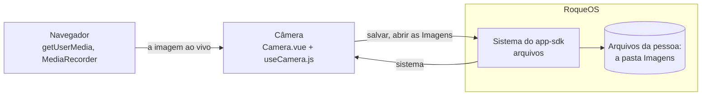

# Câmera

A Câmera do [RoqueOS](https://roqueos.com.br): fotos e vídeos com a câmera do aparelho, com
zoom (o do aparelho, ou por recorte quando ele não tem), lanterna, troca entre as câmeras,
temporizador de 3, 5 ou 10 segundos, proporção (cheia, 1:1, 4:3, 16:9), resolução de 480p a
4K, grade de terços ou áurea, espelho da câmera frontal e nível. A foto ou o vídeo vai para as
Imagens dos Arquivos, para o download ou para o compartilhar do aparelho. Nos dez idiomas do
RoqueOS.

Use de graça em [roqueos.com.br](https://roqueos.com.br), no computador, no celular e na TV.

_English below._

## Por que existe como repo

A Câmera nasceu dentro do RoqueOS, que é fechado. Em 28/09/2026 ela foi para o próprio
repositório na organização [roqueos-apps](https://github.com/roqueos-apps), na Onda 4 do
Goal 28. O RoqueOS a instala por uma tag, como dependência git, e ela fala com o RoqueOS só
pelo [`app-sdk`](https://github.com/roqueos-apps/app-sdk). A tela é feita com o kit
[`ui`](https://github.com/roqueos-apps/ui). O mesmo código roda dentro do RoqueOS, sozinho no
navegador (`yarn dev`) e no teste.

## Arquitetura



```text
app.json            quem ela é: id permanente (camera), nome e descrição nos dez idiomas,
                    ícone, cor, janela, a capacidade que pede e a pasta que ela abre
i18n/<idioma>.json  os textos da tela, um arquivo por idioma
src/
  index.js          definirApp: cria o app Vue próprio dentro do elemento que o RoqueOS dá
  Camera.vue        a tela: o visor, o enquadramento, o disparador, a captura e os ajustes
  useCamera.js      o motor: o MediaStream, a foto no canvas, o vídeo, o zoom e a lanterna
  textos.js         carrega o JSON do idioma (com ?raw) e traduz uma chave
  camera.scss       o visual
dev/main.js         o yarn dev: a Câmera numa janela falsa do RoqueOS
test/               Vitest: a tela pelo SDK, o motor, e as chaves de texto
```

### Como ela fala com o RoqueOS

Só pelo `sistema` do SDK, e a capacidade opcional está no `app.json`:

- `arquivos`: `salvar` põe a foto (`image/jpeg`) ou o vídeo (`video/webm`) nas Imagens, com o
  nome de sempre (`RoqueOS_Photo_<hora>.jpg`, `RoqueOS_Video_<hora>.webm`); `abrirPasta` abre as
  Imagens no Finder, pelo botão da galeria. A Câmera declara `"pastas": ["Imagens"]`: é a única
  pasta que ela pode abrir, e ela nunca vê caminho nem lista os arquivos da pessoa.
- `idioma`, `desempenho` (o perfil leve tira a malha animada, o desfoque e a pulsação da
  contagem), `avisar` e `metricas` (o evento `photo_capture`, o mesmo de antes).

A câmera e o microfone ela pede direto ao navegador (`getUserMedia`), porque o sistema não
media nada ali: o SDK não tem capacidade `camera`. O microfone só entra no modo vídeo.

Sem conta, o sistema recusa salvar (`sem-conta`): a Câmera avisa que é preciso entrar, a
captura continua na tela, e baixar e compartilhar continuam funcionando.

### O que nunca sai do aparelho

A imagem ao vivo não vai a lugar nenhum. A foto e o vídeo só saem quando a pessoa aperta
salvar (para os Arquivos da conta dela), baixar ou compartilhar. Fechar a janela desliga a
câmera, e a luz do aparelho apaga.

## Pré-requisitos

- Node 22 ou mais novo (o `.nvmrc` diz 24).
- Yarn 1.22.

## Como rodar

```bash
yarn install --ignore-scripts
yarn dev          # a Câmera numa janela falsa do RoqueOS, numa conta local
yarn verificar    # lint, formato, testes e app check: o mesmo do CI e do pre-push
yarn test         # só os testes
```

O `yarn dev` pede a câmera de verdade ao navegador. O que se salva vai para Arquivos em
memória e some no F5; o aviso de salvo aparece no console. A janela é redimensionável: abaixo
de 560 px de largura os rótulos do modo somem e o disparador encolhe. `?idioma=ar-AR` abre em
árabe, `?leve=1` como o aparelho fraco vê, `?convidado=1` sem conta.

## Paridade com o app de antes

`paridade.json` é o inventário do que a Câmera fazia dentro do RoqueOS e do que aconteceu com
cada coisa na saída: `mantida`, `mudou` (com a nota do que mudou) ou `perdida` (só com a
decisão escrita de quem decidiu). Cada item cita o teste deste repo que o prova, ou a
evidência. O RoqueOS confere o arquivo no pacote instalado antes de aceitar a versão: teste
citado que não existe mais, estado de dúvida ou perda sem decisão reprovam. Mudou uma
funcionalidade, ou um teste citado ali? Atualize o inventário no mesmo commit.

## Contribuir

Leia o [CONTRIBUTING.md](CONTRIBUTING.md). Todo commit leva `Signed-off-by` (DCO), e o CI
confere. Falha de segurança vai pelo [SECURITY.md](SECURITY.md), nunca por issue pública.

## Créditos e licença

[MIT](LICENSE). Os ícones são do [Material Icons](https://fonts.google.com/icons)
(Apache-2.0), pelo kit de interface; veja o [ASSETS.md](ASSETS.md). O nome e a marca RoqueOS
são da LEVELHARD e não fazem parte da licença.

---

## English

The Camera app of [RoqueOS](https://roqueos.com.br): photos and videos with the device camera,
with zoom (native, or by cropping when the device has none), torch, camera switching, a 3, 5
or 10 second timer, aspect ratio (full, 1:1, 4:3, 16:9), 480p to 4K resolution, rule-of-thirds
or golden grid, front camera mirroring and a level. A capture goes to the Pictures folder in
Files, to a download, or to the device share sheet. In all ten RoqueOS languages.

It moved out of the closed RoqueOS core on 28/09/2026 into its own repository in the
[roqueos-apps](https://github.com/roqueos-apps) organization. RoqueOS installs it by tag, and it
talks to RoqueOS only through the `sistema` of
[`@roqueos-apps/app-sdk`](https://github.com/roqueos-apps/app-sdk): `arquivos` (save to
Pictures, open Pictures in the Finder; the app declares that one folder and never sees a path),
plus language, light profile, notices and metrics. The camera and microphone are requested
straight from the browser; the live image never leaves the device, and closing the window turns
the camera off. Guests cannot save to Files (the system refuses without an account), but can
still download or share.

Run `yarn install --ignore-scripts`, then `yarn dev` (a fake RoqueOS window with a local
account) or `yarn verificar` (what CI runs). Every commit must be signed off (DCO). Licensed
under [MIT](LICENSE); icons are Material Icons (Apache-2.0). The RoqueOS name and brand belong
to LEVELHARD and are not covered.

`paridade.json` lists everything this app did inside the RoqueOS core and what happened to each
item when it moved out (kept, changed with a note, or lost only with a written decision), each
backed by a test in this repository or other evidence. RoqueOS checks it in the installed
package before accepting a version.
